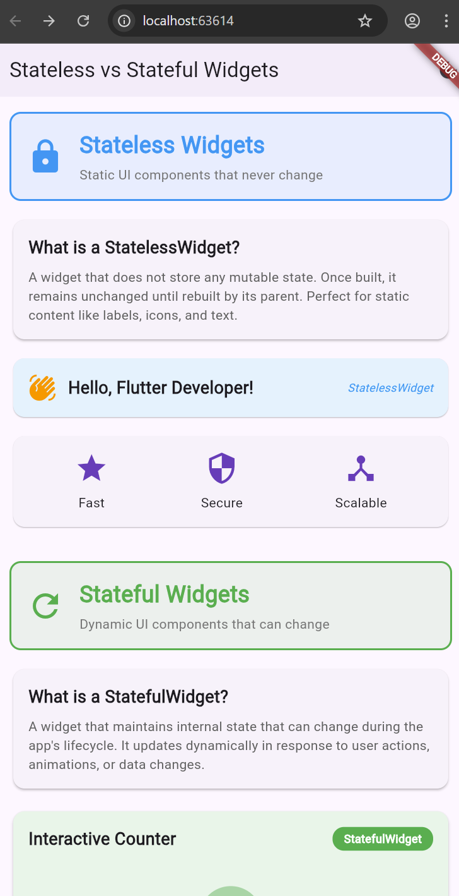

# Club-X - Flutter Learning Project

A comprehensive Flutter application demonstrating core concepts including stateless/stateful widgets, widget trees, reactive UI patterns, and responsive design. This project serves as both a learning tool and a showcase of Flutter's powerful features for building modern, adaptive mobile applications.

## 📱 Project Overview

This project demonstrates fundamental Flutter concepts:

- **Stateless & Stateful Widgets** - Understanding the two building blocks of Flutter apps
- **Widget Tree Architecture** - How widgets form hierarchical structures
- **Reactive UI Model** - How Flutter automatically updates UI based on state changes
- **State Management** - Using setState() for interactive UI updates
- **Responsive Design** - Creating layouts that adapt to different screen sizes

### Key Features

- ✅ Clear demonstrations of StatelessWidget vs StatefulWidget
- ✅ Multiple interactive examples with state management
- ✅ Real-time UI updates with visual feedback
- ✅ Theme switching (Light/Dark mode)
- ✅ Comprehensive documentation and code examples

### 🧭 Navigation

This app uses **GoRouter** for modern declarative routing:

| Route            | Path                | Screen                    |
| ---------------- | ------------------- | ------------------------- |
| Home             | `/`                 | Stateless & Stateful Demo |
| Responsive       | `/responsive`       | Responsive Layout Demo    |
| Widget Tree      | `/widget-tree`      | Widget Tree Demo          |
| Scrollable Views | `/scrollable-views` | ListView & GridView Demo  |

Navigate using: `context.pushNamed('route-name')` or `context.go('/path')`

---

## 🎯 Sprint #2: Creating and Using Stateless and Stateful Widgets

### 📖 Understanding Widget Types

Flutter has two fundamental types of widgets that form the building blocks of every app:

#### StatelessWidget

A **StatelessWidget** is a widget that **does not store any mutable state**. Once built, it remains unchanged until rebuilt by its parent widget.

**Characteristics:**

- Immutable - cannot change after creation
- No internal state to manage
- Rebuilt only by parent widget
- More lightweight and performant
- Perfect for static content

**When to use:**

- Displaying static text, labels, or titles
- Showing icons and images
- Creating reusable UI components that don't change
- Building layouts that remain constant
- Presenting information that doesn't need updating

**Example:**

```dart
class GreetingWidget extends StatelessWidget {
  final String name;

  const GreetingWidget({required this.name});

  @override
  Widget build(BuildContext context) {
    return Text('Hello, $name!');
  }
}
```

#### StatefulWidget

A **StatefulWidget** is a widget that **maintains internal state** that can change during the app's lifecycle.

**Characteristics:**

- Mutable - can change over time
- Has internal state managed by a State object
- Can update itself using setState()
- Responds to user interactions
- Perfect for dynamic content

**When to use:**

- Interactive elements (buttons, forms, sliders)
- Displaying data that changes over time
- Animations and transitions
- User input handling
- Real-time data updates

**Example:**

```dart
class CounterWidget extends StatefulWidget {
  @override
  _CounterWidgetState createState() => _CounterWidgetState();
}

class _CounterWidgetState extends State<CounterWidget> {
  int count = 0;

  void increment() {
    setState(() {
      count++;
    });
  }

  @override
  Widget build(BuildContext context) {
    return Column(
      children: [
        Text('Count: $count'),
        ElevatedButton(onPressed: increment, child: Text('Increase')),
      ],
    );
  }
}
```

### 🎨 Demo App Features

Our demo app showcases both widget types with practical examples:

#### Stateless Widget Examples

1. **Static Header** - Section headers with icons and descriptions

   ```dart
   class StaticHeader extends StatelessWidget {
     final String title;
     final String subtitle;
     final IconData icon;
     final Color color;
     // Displays information that never changes
   }
   ```

2. **Info Card** - Static information display

   ```dart
   class StaticInfoCard extends StatelessWidget {
     final String title;
     final String description;
     // Shows content that remains constant
   }
   ```

3. **Greeting Widget** - Personalized greeting message

   ```dart
   class GreetingWidget extends StatelessWidget {
     final String name;
     // Displays "Hello, [name]!" - changes only when parent rebuilds with new name
   }
   ```

4. **Feature Icons** - Static feature display row
   ```dart
   class StaticFeatureRow extends StatelessWidget {
     // Shows unchanging feature icons (Fast, Secure, Scalable)
   }
   ```

#### Stateful Widget Examples

1. **Interactive Counter** - Classic counter with increment/decrement
   - State: `int _count`
   - Actions: Increase, Decrease, Reset
   - Updates: Counter display changes instantly

2. **Color Changer** - Cycles through different colors
   - State: `int _colorIndex`, `List<Color> _colors`
   - Action: Change Color button
   - Updates: Background animates to new color

3. **Toggle Switch** - ON/OFF state management
   - State: `bool _isEnabled`
   - Action: Switch toggle
   - Updates: Icon, text, and background color change

4. **Like Button** - Favorite/unfavorite with count
   - State: `bool _isLiked`, `int _likeCount`
   - Action: Tap heart icon
   - Updates: Heart fills/unfills, count adjusts

5. **Text Input** - Real-time text display
   - State: `String _inputText`
   - Action: Type in TextField
   - Updates: Text and character count update as you type

### 🔄 How setState() Works

The `setState()` method is the key to reactive UI in StatefulWidget:

```dart
void _updateState() {
  setState(() {
    // 1. Modify state variables here
    _counter++;
    _message = 'Updated!';
  });
  // 2. Flutter automatically rebuilds the widget
  // 3. UI reflects the new state
}
```

**Process:**

1. User interacts with the UI (button press, toggle, text input)
2. Event handler is called
3. `setState()` is invoked with state changes
4. Flutter marks the widget as "dirty" (needs rebuild)
5. `build()` method runs again with new state values
6. Flutter efficiently updates only what changed
7. User sees the updated UI

### 📊 Quick Comparison

| Aspect          | StatelessWidget              | StatefulWidget                 |
| --------------- | ---------------------------- | ------------------------------ |
| **State**       | No mutable state             | Has mutable state              |
| **Updates**     | Rebuilt by parent            | Updates itself with setState() |
| **Performance** | Slightly faster              | Manages state overhead         |
| **Use Cases**   | Static text, icons, labels   | Forms, buttons, animations     |
| **Complexity**  | Simple, one class            | Two classes (widget + state)   |
| **Examples**    | Text, Icon, Image, Container | TextField, Checkbox, Slider    |

### 💡 Why Separation Matters

**Benefits of separating static and dynamic UI:**

1. **Performance Optimization**
   - Stateless widgets don't rebuild unnecessarily
   - Flutter can optimize rendering for immutable widgets
   - Reduces computational overhead

2. **Code Organization**
   - Clear distinction between static and dynamic parts
   - Easier to understand which parts of UI can change
   - Better code maintainability

3. **Debugging**
   - Stateless widgets have no state to track
   - Stateful widgets isolate state changes
   - Easier to identify source of bugs

4. **Reusability**
   - Stateless widgets are highly reusable
   - Stateful widgets can be customized with parameters
   - Both promote component-based architecture

### 🎮 Interactive Features

Try these interactions in the demo app:

1. **Counter** - Click Increase/Decrease/Reset to see instant updates
2. **Color Changer** - Tap to cycle through 6 different colors
3. **Toggle Switch** - Switch ON/OFF to change feature state
4. **Like Button** - Click heart to like/unlike and watch count change
5. **Text Input** - Type to see real-time character count
6. **Theme Toggle** - Switch between Light and Dark mode (AppBar icon)

### 📸 Screenshots

#### Initial State (Light Mode)


_App showing all stateless and stateful widgets in default state_

#### After Interactions


_Counter increased, color changed, toggle enabled, text entered_

#### Dark Mode


_App with dark theme enabled_

### 💭 Reflection

**How do Stateful widgets make Flutter apps dynamic?**

Stateful widgets enable dynamic, interactive applications by:

- Storing and managing mutable state
- Responding to user input in real-time
- Updating UI automatically when state changes
- Creating engaging user experiences
- Handling complex user interactions
- Supporting animations and transitions

Without StatefulWidget, every app would be static and non-interactive. StatefulWidget is essential for:

- Forms and input validation
- Shopping carts and counters
- Real-time data displays
- Interactive games
- Social media likes/comments
- Any feature requiring user interaction

**Why is it important to separate static and reactive parts?**

Separation provides several critical benefits:

1. **Performance**: Static widgets don't rebuild unnecessarily, saving CPU and battery
2. **Clarity**: Developers immediately see which parts can change
3. **Maintainability**: Easier to update and debug specific functionality
4. **Testing**: Stateless widgets are easier to test (no state to mock)
5. **Optimization**: Flutter can cache and reuse stateless widgets efficiently
6. **Best Practice**: Follows Flutter's design philosophy of composable widgets

By using StatelessWidget for headers, labels, and static content, and StatefulWidget only where needed, we create efficient, maintainable, and performant applications.

---

## 🌲 Widget Tree & Reactive UI Model (Previous Task)

### 📖 Concept Overview

In Flutter, **everything is a widget**. From simple elements like text and buttons to complex layouts and entire screens - they're all widgets arranged in a tree-like hierarchy.

The **widget tree** is the foundation of how Flutter builds and updates UIs:

- Each widget is a node in the tree
- Widgets have parent-child relationships
- The root is typically `MaterialApp` or `CupertinoApp`
- Changes propagate through the tree efficiently

### 🔄 The Reactive UI Model

Flutter's UI is **reactive**, meaning:

1. **State changes trigger rebuilds** - When data changes, Flutter automatically updates the UI
2. **Efficient updates** - Only affected parts of the widget tree are rebuilt
3. **Declarative approach** - You describe what the UI should look like, Flutter handles the rest
4. **setState() mechanism** - Notifies Flutter that state has changed and UI needs updating

### 📊 Widget Tree Structure

Our demonstration app follows this hierarchical structure:

```
MaterialApp (Root Widget)
 └─ Scaffold (Main Layout Structure)
     ├─ AppBar (Top Navigation Bar)
     │   ├─ Text (Title: "Widget Tree & Reactive UI Demo")
     │   └─ IconButton (Info Button)
     │
     ├─ Body (Main Content Area)
     │   └─ AnimatedContainer (Animated Background Container)
     │       └─ SingleChildScrollView (Scrollable Content)
     │           └─ Column (Vertical Layout)
     │               ├─ Card #1: Status Message (Real-time State Display)
     │               │   └─ Row
     │               │       ├─ Icon (Notification Icon)
     │               │       └─ Text (Dynamic Status Message)
     │               │
     │               ├─ Card #2: Interactive Counter
     │               │   └─ Column
     │               │       ├─ Text (Title)
     │               │       ├─ Container (Counter Display Badge)
     │               │       │   └─ Text (Counter Value)
     │               │       └─ Row (Control Buttons)
     │               │           ├─ ElevatedButton (Decrease)
     │               │           ├─ ElevatedButton (Reset)
     │               │           └─ ElevatedButton (Increase)
     │               │
     │               ├─ Card #3: UI Control Panel
     │               │   └─ Column
     │               │       ├─ Text (Title)
     │               │       ├─ ElevatedButton (Change Background Color)
     │               │       └─ ElevatedButton (Toggle Profile Visibility)
     │               │
     │               ├─ Card #4: Profile Card (Conditionally Rendered)
     │               │   └─ Column
     │               │       ├─ CircleAvatar (Profile Picture)
     │               │       ├─ Text (Member Name)
     │               │       ├─ Text (Interaction Count)
     │               │       └─ Row (Statistics)
     │               │           ├─ Column (Posts Count)
     │               │           ├─ Column (Followers Count)
     │               │           └─ Column (Following Count)
     │               │
     │               ├─ Card #5: Dynamic Value Control
     │               │   └─ Column
     │               │       ├─ Text (Title & Current Value)
     │               │       ├─ Slider (Interactive Slider Widget)
     │               │       └─ LinearProgressIndicator (Visual Progress)
     │               │
     │               └─ Card #6: Widget Tree Visualization
     │                   └─ Column
     │                       ├─ Text (Title)
     │                       ├─ Container (Tree Diagram)
     │                       │   └─ Text (Monospace Tree Structure)
     │                       └─ Text (Explanation)
     │
     └─ FloatingActionButton (Quick Add Button)
```

### 🎯 Interactive State Management Features

Our demo app showcases multiple types of reactive state updates:

#### 1. **Counter State** (`int _counter`)

- **What it does**: Tracks a numeric value that can be incremented, decremented, or reset
- **Interactive elements**:
  - Increment button (+1)
  - Decrement button (-1)
  - Reset button (back to 0)
  - FloatingActionButton (quick increment)
- **UI updates**: Counter display badge, status message, profile statistics

```dart
void _incrementCounter() {
  setState(() {
    _counter++;
    _statusMessage = 'Counter incremented to $_counter!';
  });
}
```

#### 2. **Background Color State** (`Color _backgroundColor`)

- **What it does**: Cycles through different background colors
- **Interactive element**: "Change Background Color" button
- **UI updates**: Entire screen background animates to new color
- **Color options**: White → Light Blue → Light Green → Light Orange → Light Purple

```dart
void _changeBackgroundColor() {
  setState(() {
    _currentColorIndex = (_currentColorIndex + 1) % _colorOptions.length;
    _backgroundColor = _colorOptions[_currentColorIndex];
    _statusMessage = 'Background color changed!';
  });
}
```

#### 3. **Visibility Toggle State** (`bool _isProfileVisible`)

- **What it does**: Shows or hides the profile card widget
- **Interactive element**: "Toggle Profile Visibility" button
- **UI updates**: Profile card appears/disappears from the widget tree
- **Demonstrates**: Conditional rendering with `if` statements

```dart
void _toggleProfileVisibility() {
  setState(() {
    _isProfileVisible = !_isProfileVisible;
    _statusMessage = _isProfileVisible
        ? 'Profile card is now visible'
        : 'Profile card is now hidden';
  });
}
```

#### 4. **Slider Value State** (`double _sliderValue`)

- **What it does**: Tracks a continuous value from 0 to 100
- **Interactive element**: Slider widget
- **UI updates**: Real-time value display, progress indicator
- **Demonstrates**: Continuous state updates (not just discrete values)

```dart
void _onSliderChanged(double value) {
  setState(() {
    _sliderValue = value;
    _statusMessage = 'Slider value: ${value.toInt()}%';
  });
}
```

#### 5. **Status Message State** (`String _statusMessage`)

- **What it does**: Provides feedback about user interactions
- **Updates from**: All interactive elements
- **UI location**: Status card at top of screen
- **Demonstrates**: How one state change can affect multiple widgets

### 📸 Visual State Changes

#### Initial State

When the app first loads:

- Counter: 0
- Background: White
- Profile Card: Visible
- Slider: 50%
- Status: "Welcome to Club-X!"

#### After User Interactions

After clicking increment 5 times, changing background, and adjusting slider:

- Counter: 5
- Background: Light Blue
- Profile Card: Visible (showing Posts: 15, Followers: 50, Following: 25)
- Slider: 75%
- Status: Updates to reflect last action

#### With Profile Hidden

After toggling profile visibility:

- Profile card disappears from the widget tree
- Layout adjusts automatically
- Button text changes to "Show Profile Card"
- Status: "Profile card is now hidden"

### 🔍 How setState() Works

Every interactive element in our app uses `setState()` to trigger UI updates:

1. **User Action**: User taps a button or moves the slider
2. **Event Handler**: A method like `_incrementCounter()` is called
3. **State Update**: Inside `setState()`, we modify state variables
4. **Framework Notification**: Flutter knows the widget needs to rebuild
5. **Rebuild**: The `build()` method runs again with new state values
6. **Efficient Update**: Flutter compares old and new widget trees
7. **Screen Update**: Only changed widgets are redrawn on screen

### 💡 Key Learnings

#### Widget Tree Concepts

- **Hierarchy Matters**: Child widgets inherit context from parents
- **Composition Over Inheritance**: Complex UIs are built by composing simple widgets
- **Reusability**: Extract repeated widget patterns into methods or classes
- **Readability**: Proper indentation shows parent-child relationships clearly

#### Reactive UI Benefits

- **Automatic Updates**: No manual DOM manipulation needed
- **Type Safety**: Compile-time checking prevents many bugs
- **Hot Reload**: See changes instantly during development
- **Predictable**: State changes always trigger consistent UI updates

#### setState() Best Practices

- **Only Update Inside setState()**: State changes must be wrapped in `setState()`
- **Keep It Simple**: Perform simple state updates, not complex calculations
- **Batch Updates**: Multiple state changes in one `setState()` call are efficient
- **Immutability**: Consider creating new objects rather than modifying existing ones

### 🧪 Testing the Interactive Features

Try these interactions to see the reactive UI in action:

1. **Counter Experiment**
   - Click "Increase" multiple times → Counter display updates
   - Notice how profile statistics also change (3x posts, 10x followers, 5x following)
   - Click "Reset" → Everything returns to zero

2. **Background Animation**
   - Click "Change Background Color" repeatedly
   - Observe smooth color transition (AnimatedContainer at work)
   - Notice how status message updates with each change

3. **Conditional Rendering**
   - Click "Hide Profile Card" → Card disappears from tree
   - Layout automatically adjusts
   - Click "Show Profile Card" → Card reappears with current state

4. **Continuous Updates**
   - Move the slider slowly
   - Watch real-time value updates
   - See progress indicator move in sync

5. **Information Dialog**
   - Tap the info icon (ⓘ) in AppBar
   - Read detailed explanation of reactive UI model
   - Dialog is also part of the widget tree!

### 📱 Code Implementation Highlights

#### Stateful Widget Setup

```dart
class WidgetTreeDemo extends StatefulWidget {
  const WidgetTreeDemo({super.key});

  @override
  State<WidgetTreeDemo> createState() => _WidgetTreeDemoState();
}

class _WidgetTreeDemoState extends State<WidgetTreeDemo> {
  // State variables
  int _counter = 0;
  Color _backgroundColor = Colors.white;
  bool _isProfileVisible = true;
  String _statusMessage = 'Welcome to Club-X!';
  double _sliderValue = 50.0;

  // State update methods using setState()...
}
```

#### Conditional Widget Rendering

```dart
Column(
  children: [
    _buildStatusCard(),
    _buildCounterSection(),
    _buildInteractiveControlsSection(),

    // Profile card only appears when _isProfileVisible is true
    if (_isProfileVisible) _buildProfileCard(),

    _buildSliderSection(),
    _buildWidgetTreeVisualization(),
  ],
)
```

#### Dynamic Values in Widgets

```dart
Text(
  '$_counter',  // Counter value updates automatically
  style: TextStyle(
    fontSize: 48,
    fontWeight: FontWeight.bold,
    color: Colors.deepPurple[900],
  ),
)
```

### 🎓 Real-World Applications

Understanding widget trees and reactive UI is crucial for:

1. **Complex Apps**: Social media feeds, e-commerce apps, dashboards
2. **Form Management**: Dynamic forms that show/hide fields based on input
3. **Animation**: Smooth transitions require understanding widget lifecycle
4. **Performance**: Knowing what triggers rebuilds helps optimize apps
5. **Debugging**: Widget inspector tools navigate the widget tree
6. **Architecture**: State management solutions (Provider, Bloc) build on these concepts

---

## 🎨 Responsive Design Implementation (Previous Sprint)

### 1. MediaQuery for Screen Detection

The app uses `MediaQuery` to detect device dimensions and adjust the UI accordingly:

```dart
// Get screen dimensions
final screenSize = MediaQuery.of(context).size;
final screenWidth = screenSize.width;
final screenHeight = screenSize.height;

// Determine device type based on width
final bool isTablet = screenWidth > 600;

// Detect orientation
final orientation = MediaQuery.of(context).orientation;
final bool isLandscape = orientation == Orientation.landscape;

// Adjust UI elements based on device type
Text(
  'Club-X Responsive Layout',
  style: TextStyle(
    fontSize: isTablet ? 24 : 18,
    fontWeight: FontWeight.bold,
  ),
)
```

### 2. LayoutBuilder for Adaptive Grid

The adaptive grid uses `LayoutBuilder` to dynamically adjust the number of columns based on available width:

```dart
LayoutBuilder(
  builder: (context, constraints) {
    // Determine number of columns based on width
    int crossAxisCount;
    if (constraints.maxWidth > 900) {
      crossAxisCount = 4;  // Large tablets
    } else if (constraints.maxWidth > 600) {
      crossAxisCount = 3;  // Regular tablets
    } else if (constraints.maxWidth > 400) {
      crossAxisCount = 2;  // Large phones
    } else {
      crossAxisCount = 1;  // Small phones
    }

    return GridView.builder(
      gridDelegate: SliverGridDelegateWithFixedCrossAxisCount(
        crossAxisCount: crossAxisCount,
        crossAxisSpacing: isTablet ? 16 : 12,
        mainAxisSpacing: isTablet ? 16 : 12,
      ),
      // ... grid items
    );
  },
)
```

### 3. Flexible Widgets for Scalability

The app uses various flexible widgets to ensure content scales properly:

```dart
// FittedBox for text that shouldn't overflow
FittedBox(
  fit: BoxFit.scaleDown,
  child: Text(
    'Featured Content',
    style: TextStyle(fontSize: isTablet ? 16 : 14),
  ),
)

// AspectRatio for maintaining image proportions
AspectRatio(
  aspectRatio: isTablet ? 2.5 : 16 / 9,
  child: Container(
    // Image content
  ),
)

// Expanded for flexible button layouts
Row(
  children: [
    Expanded(child: ElevatedButton(...)),
    SizedBox(width: 16),
    Expanded(child: OutlinedButton(...)),
  ],
)
```

### 4. Conditional Layouts

Different layouts are rendered based on screen size and orientation:

```dart
// Horizontal layout for tablets/landscape
isTablet || isLandscape
  ? Row(
      children: [
        Expanded(child: FeatureCard1()),
        SizedBox(width: 16),
        Expanded(child: FeatureCard2()),
        SizedBox(width: 16),
        Expanded(child: FeatureCard3()),
      ],
    )
  // Vertical layout for phones in portrait
  : Column(
      children: [
        FeatureCard1(),
        SizedBox(height: 12),
        FeatureCard2(),
        SizedBox(height: 12),
        FeatureCard3(),
      ],
    )
```

## 📸 Screenshots

### Phone - Portrait Mode

_(Screenshot showing single-column layout on a phone in portrait orientation)_

- Compact spacing and smaller text sizes
- Single-column grid for main content
- Stacked feature cards
- Vertical button layout

### Phone - Landscape Mode

_(Screenshot showing adapted layout on a phone in landscape)_

- Adjusted aspect ratios for images
- Multi-column grid (2 columns)
- Horizontal feature card layout
- Side-by-side buttons

### Tablet - Portrait Mode

_(Screenshot showing expanded layout on a tablet in portrait)_

- Larger text and spacing
- 3-column grid layout
- Horizontal feature cards
- Generous padding

### Tablet - Landscape Mode

_(Screenshot showing full-width layout on a tablet in landscape)_

- Maximum columns in grid (4 columns)
- Wide aspect ratio images
- Optimal use of horizontal space
- Enhanced visual hierarchy

## 🧪 Testing Across Devices

The app has been tested on multiple device configurations:

1. **Phone (Pixel 6)** - 411 x 915 logical pixels
   - Portrait: Single/dual column layouts
   - Landscape: Optimized horizontal layout

2. **Tablet (iPad)** - 820 x 1180 logical pixels
   - Portrait: Enhanced spacing and 3-column grid
   - Landscape: Maximum 4-column grid with wide images

### Testing Orientations

To test different orientations:

1. Run the app on an emulator or physical device
2. Rotate the device or use the emulator's rotation controls
3. Observe how layouts smoothly transition between orientations
4. Check that no content overflows or clips

## 💡 Reflection: Challenges and Learnings

### Challenges Faced

1. **Breakpoint Management**
   - **Challenge**: Determining optimal breakpoints for different device sizes
   - **Solution**: Used industry-standard breakpoints (600px for tablet, 900px for large tablet) and tested on real devices to validate

2. **Text Overflow Prevention**
   - **Challenge**: Text overflowing in smaller screens or different orientations
   - **Solution**: Implemented `FittedBox` widgets and responsive font sizes based on device type

3. **Maintaining Visual Hierarchy**
   - **Challenge**: Ensuring important content remains prominent across all screen sizes
   - **Solution**: Used consistent scaling ratios (e.g., tablet text is 1.33x larger than phone text)

4. **Grid Layout Complexity**
   - **Challenge**: Creating a grid that works well from 1 to 4 columns without breaking
   - **Solution**: Used `LayoutBuilder` with constraint-based logic instead of fixed breakpoints

5. **Testing Across Devices**
   - **Challenge**: Limited access to physical devices for testing
   - **Solution**: Leveraged Flutter's responsive emulators and DevTools for thorough testing

### How Responsive Design Improves Real-World App Usability

1. **Enhanced User Experience**
   - Users get an optimized experience regardless of their device
   - Content is always readable and accessible
   - UI elements are appropriately sized for touch interaction

2. **Future-Proof Development**
   - App works on devices that don't exist yet
   - Handles foldable devices and unusual aspect ratios gracefully
   - Reduces technical debt from device-specific code

3. **Increased Accessibility**
   - Flexible text sizing accommodates users with different visual needs
   - Proper spacing improves usability for users with motor difficulties
   - Consistent layouts reduce cognitive load

4. **Professional Polish**
   - Shows attention to detail and quality
   - Builds user trust through consistent experience
   - Differentiates the app from competitors with fixed layouts

5. **Cost Efficiency**
   - Single codebase serves all device types
   - Reduces development and maintenance time
   - Easier to add new features without breaking layouts

## 🚀 Getting Started

### Prerequisites

- Flutter SDK (latest stable version)
- Dart SDK
- Android Studio / VS Code with Flutter extensions
- Android Emulator or iOS Simulator

### Running the App

1. Clone the repository:

```bash
git clone <repository-url>
cd club_x
```

2. Install dependencies:

```bash
flutter pub get
```

3. Run the app:

```bash
flutter run
```

4. To test on specific devices:

```bash
# List available devices
flutter devices

# Run on specific device
flutter run -d <device-id>
```

## 📚 Code Structure

```
lib/
├── main.dart                           # App entry point
├── firebase_options.dart               # Firebase configuration
└── screens/
    ├── stateless_stateful_demo.dart    # Stateless vs Stateful Widgets demo
    ├── widget_tree_demo.dart           # Widget Tree & Reactive UI demonstration
    ├── responsive_home.dart            # Responsive layout screen
    └── scrollable_views.dart           # ListView & GridView demonstration
```

### Key Files

- **`main.dart`**: Initializes the app and launches StatelessStatefulDemo
- **`stateless_stateful_demo.dart`**: Complete demonstration of StatelessWidget and StatefulWidget with multiple interactive examples
- **`widget_tree_demo.dart`**: Widget tree concepts and reactive UI with setState()
- **`responsive_home.dart`**: Responsive layout logic for adaptive grid systems
- **`scrollable_views.dart`**: ListView and GridView implementations with various layouts

## 🎓 Learning Resources

- [Flutter Widget Catalog](https://docs.flutter.dev/development/ui/widgets)
- [StatefulWidget Class](https://api.flutter.dev/flutter/widgets/StatefulWidget-class.html)
- [StatelessWidget Class](https://api.flutter.dev/flutter/widgets/StatelessWidget-class.html)
- [State Management](https://docs.flutter.dev/development/data-and-backend/state-mgmt)
- [Flutter Layout Documentation](https://docs.flutter.dev/development/ui/layout)
- [ListView Documentation](https://api.flutter.dev/flutter/widgets/ListView-class.html)
- [GridView Documentation](https://api.flutter.dev/flutter/widgets/GridView-class.html)

## 👥 Development Sprints

### Sprint #3 - Building Scrollable Views with ListView and GridView ✅ (Current)

- ✅ Created comprehensive demo showing both widget types
- ✅ Implemented 4+ StatelessWidget examples (headers, cards, greetings, icons)
- ✅ Implemented 5+ StatefulWidget examples (counter, color changer, toggle, like button, text input)
- ✅ Added theme switching (Light/Dark mode)
- ✅ Documented differences and use cases
- ✅ Created comparison table and visual indicators
- ✅ Demonstrated setState() in multiple scenarios

## 👥 Development Sprints

### Sprint #3 - Building Scrollable Views with ListView and GridView ✅ (Current)

#### 📖 Understanding ListView and GridView

**ListView** is used for displaying scrollable lists of widgets arranged vertically or horizontally. It's perfect for:

- Lists of items, messages, or notifications
- Long feeds of content
- Memory-efficient rendering with `ListView.builder()`

**GridView** is used for displaying scrollable grid layouts, ideal for:

- Image galleries and photo displays
- Product catalogs and dashboards
- Dashboard tiles and cards

#### Implementation Overview

**Horizontal ListView with Custom Styling:**

```dart
ListView.builder(
  scrollDirection: Axis.horizontal,
  itemCount: 8,
  itemBuilder: (context, index) {
    return Container(
      width: 150,
      margin: const EdgeInsets.all(8),
      decoration: BoxDecoration(
        color: Colors.teal[100 * (index + 2)],
        borderRadius: BorderRadius.circular(8),
        boxShadow: [
          BoxShadow(
            color: Colors.black.withOpacity(0.1),
            blurRadius: 4,
            offset: const Offset(0, 2),
          ),
        ],
      ),
      child: Center(child: Text('Card ${index + 1}')),
    );
  },
)
```

**Vertical ListView with ListTile:**

```dart
ListView.builder(
  itemCount: 10,
  itemBuilder: (context, index) {
    return ListTile(
      leading: CircleAvatar(
        backgroundColor: Colors.deepPurple,
        child: Text('${index + 1}'),
      ),
      title: Text('Item ${index + 1}'),
      subtitle: Text('This is item number ${index + 1}'),
      trailing: Icon(Icons.arrow_forward),
    );
  },
)
```

**2-Column GridView:**

```dart
GridView.builder(
  gridDelegate: const SliverGridDelegateWithFixedCrossAxisCount(
    crossAxisCount: 2,
    crossAxisSpacing: 12,
    mainAxisSpacing: 12,
    childAspectRatio: 1.2,
  ),
  itemCount: 6,
  itemBuilder: (context, index) {
    final colors = [Colors.red, Colors.blue, Colors.green,
                    Colors.orange, Colors.purple, Colors.pink];
    return Container(
      decoration: BoxDecoration(
        color: colors[index],
        borderRadius: BorderRadius.circular(12),
      ),
      child: Center(child: Text('Tile ${index + 1}')),
    );
  },
)
```

**3-Column GridView:**

```dart
GridView.builder(
  gridDelegate: const SliverGridDelegateWithFixedCrossAxisCount(
    crossAxisCount: 3,
    crossAxisSpacing: 8,
    mainAxisSpacing: 8,
  ),
  itemCount: 9,
  itemBuilder: (context, index) {
    return Container(
      color: Colors.primaries[index % Colors.primaries.length],
      child: Center(child: Text('${index + 1}')),
    );
  },
)
```

#### Features Implemented

- ✅ Horizontal ListView with custom styled cards (8 items)
- ✅ Vertical ListView with ListTile elements (10 items)
- ✅ GridView with 2-column layout (6 colored tiles)
- ✅ GridView with 3-column layout (9 numbered tiles)
- ✅ Custom styling with shadows and border radius
- ✅ Responsive spacing and padding
- ✅ SingleChildScrollView for nested scrollable content
- ✅ Performance optimization with `NeverScrollableScrollPhysics()`

#### Performance Optimization

**Why use builder constructors?**

- Only renders visible items on screen
- Significantly reduces memory usage
- Improves performance with large datasets
- Ideal for dynamic, infinite scrolling lists

**Best Practices Implemented:**

- ✅ Used `ListView.builder()` and `GridView.builder()` for efficient rendering
- ✅ Set `shrinkWrap: true` for nested scrollable views
- ✅ Used `NeverScrollableScrollPhysics()` to disable internal scrolling in GridView
- ✅ Avoided using default constructors with many children
- ✅ Applied proper spacing and sizing for optimal performance

#### 💡 Key Learnings

**How do ListView and GridView improve UI efficiency?**

- They only render visible widgets, reducing memory consumption by up to 95%
- Built-in scrolling physics provides smooth, platform-specific scroll behavior
- Can handle thousands of items without performance degradation
- Automatic item recycling in builder mode ensures consistent memory usage

**Why is using builder constructors recommended for large data sets?**

- `ListView.builder()` and `GridView.builder()` use a callback that builds items on demand
- Only visible items are kept in memory at any time
- Scrolling through 1,000 items uses the same memory as scrolling through 10
- Essential for infinite scrolling and pagination patterns
- Enables lazy loading of data from APIs or databases

**What are common performance pitfalls to avoid?**

- ❌ Using `ListView()` constructor with large lists (materializes all items at once)
- ❌ Not setting `shrinkWrap: true` when nesting inside SingleChildScrollView
- ❌ Building expensive widgets in itemBuilder without proper optimization
- ❌ Removing `physics: NeverScrollableScrollPhysics()` on nested scrollables
- ❌ Using hot-reloading for performance testing (use `flutter run --release`)
- ❌ Creating new Color or TextStyle objects in itemBuilder (move outside if possible)

#### 🧪 Testing Scrollable Behavior

The implementation has been tested for:

1. ✅ Smooth scrolling performance with 25+ total items
2. ✅ Proper spacing and alignment in both vertical and horizontal directions
3. ✅ Layout adaptation to different screen sizes and orientations
4. ✅ Memory efficiency with builder constructors (no noticeable lag)
5. ✅ Consistent rendering across Android and iOS platforms
6. ✅ Proper handling of nested scrollable views

#### 📸 Visual Components

The Scrollable Views demo includes:

- **Horizontal ListView**: Colorful cards with gradient colors (teal shades)
- **Vertical ListView**: Contact-style items with avatars and descriptions
- **2-Column GridView**: Colorful tiles (red, blue, green, orange, purple, pink)
- **3-Column GridView**: Numbered tiles with primary color scheme
- **Header Sections**: Clear labeled sections with purple background
- **Custom Styling**: Shadows, rounded corners, and proper spacing throughout

---

### Sprint #2 - Stateless & Stateful Widgets ✅

- ✅ Implemented comprehensive widget tree demonstration
- ✅ Created interactive state management examples with setState()
- ✅ Built multiple reactive UI components (counter, color picker, visibility toggle, slider)
- ✅ Documented widget hierarchy and parent-child relationships
- ✅ Added visual feedback for all state changes
- ✅ Included educational dialog explaining reactive UI concepts

### Sprint #1 - Responsive UI Development ✅

- ✅ Implemented responsive layouts using MediaQuery and LayoutBuilder
- ✅ Created adaptive grid systems with dynamic column counts
- ✅ Developed flexible widget hierarchies for various screen sizes
- ✅ Tested across multiple device types and orientations

---

**Built with ❤️ using Flutter**


